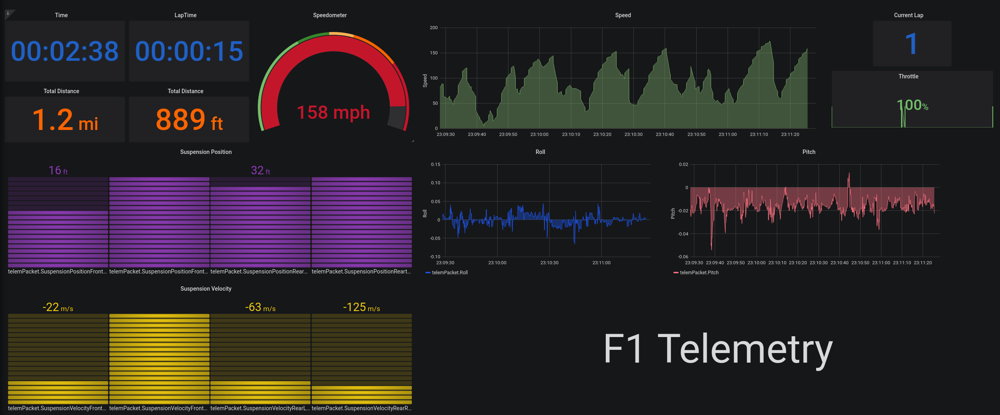

# F1-telemetry
Telemetry client for F1, in GoLang

UDP Packets were recorded using [this Go package](./ByteWriter)

The later Playback of packets, and parsing of packets was also done in Golang

## Folders
| Folder         | Purpose                                       |
| -------------- | --------------------------------------------- |
| ByteWriter     | Record UDP data from F1 for later use         |
| PacketPlayback | Playback UDP data from folder of `.bin` files |
| Telemetry      | Consumes UDP packets, writes to InfluxDB      |

I decided to use InfluxDB as my time series Database, as it is quite popular for realtime analytics.
I installed this locally on a ubuntu machine as per [this](./F1-Telemetry/influxsender/InfluxConnectionInstructions.md).

## Structure:
- udp packet player in GO publishes on `20777`
- recorder reads this datagram from `20777` and converts to a F1Packet struct
- influxdb object sends this packet, converted, to influxdb
- Graphana queries influxdb and visualizes it.

Using Grafana and InfluxDB
https://grafana.com/docs/grafana/latest/features/datasources/influxdb/